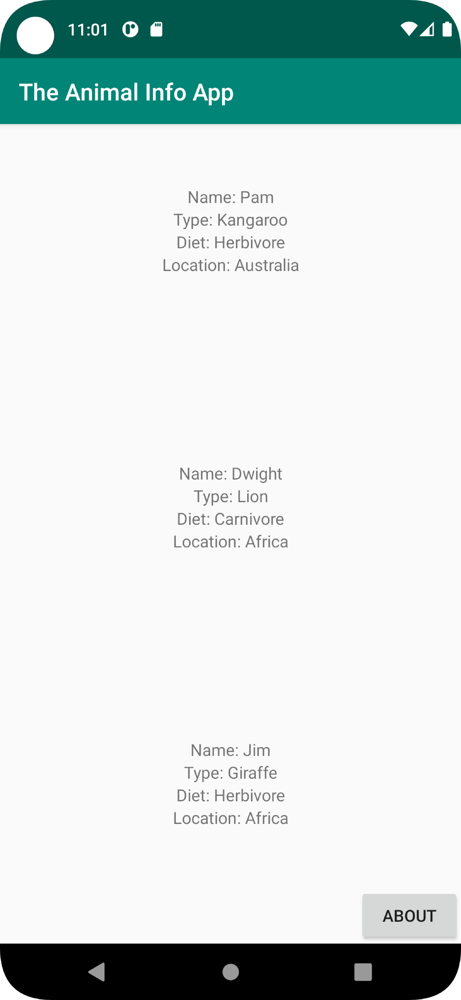
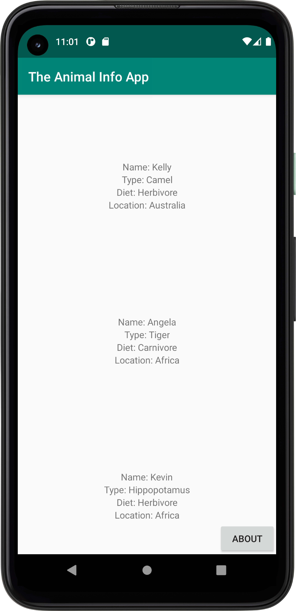
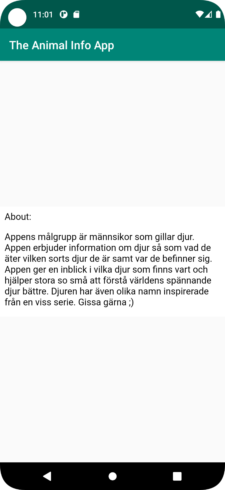
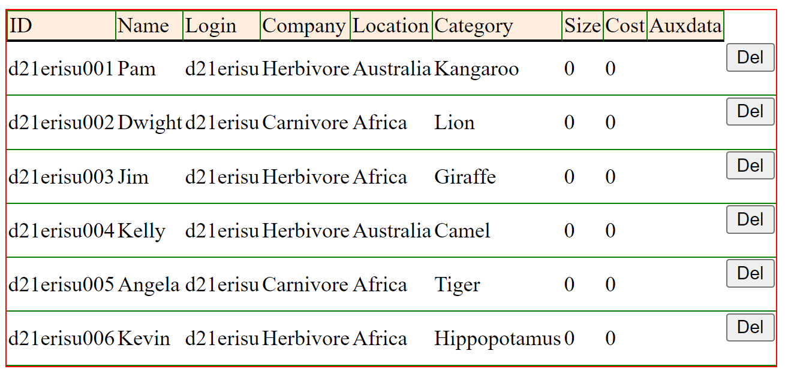

Jag gjorde ingen skiss men innan jag började att koda så hade jag en uppfattning om hur jag ville att det skulle se ut. Var knappen skulle vara osv.

Det första jag gjorde var att skapa en recyclerview, så jag la till en recyclerview i min activity main xml fil. Därefter skapade jag en adapter till
min recyclerview och skapade en listItem xml fil som agerar mall för hur varje "instans/ruta" i recycler viewen ska se ut och vad den ska ha för innehåll. 
Jag gjorde ett par tewtviews i listitemxml som ska visa upp de olika attributen från mina objekt.

I adaptern har jag en metod "setAnimals" som "updaterar" listan som skapas i "mainactivity"så att det är faktiska värden som matas in i recyclerviewen.
Metoden "onBindViewHolder" sätter in attributen som text i recyclerviewen.
Metoden "AnimalViewHOlder" kopplar ett visst attribut till en viss textview i itemlistxml.
Min adapter-klass ser ut som följande:
```
public class AnimalAdapter extends RecyclerView.Adapter<AnimalAdapter.AnimalViewHolder>{
    private List<Animal> animals;
    public AnimalAdapter(List<Animal> animals) {this.animals = animals;}

    public void setAnimals(List<Animal> animals) {
        this.animals = animals;
    }

    @NonNull
    @Override
    public AnimalViewHolder onCreateViewHolder(@NonNull ViewGroup parent, int viewType) {
        View view = LayoutInflater.from(parent.getContext()).inflate(R.layout.list_item,parent,false);
        return new AnimalViewHolder(view);
    }
    @Override
    public void onBindViewHolder(@NonNull AnimalViewHolder holder, int position) {
        Animal animal = animals.get(position);

        holder.animal_id.setText(animal.getId());
        holder.animal_name.setText("Name: " + animal.getName());
        holder.animal_company.setText("Diet: " + animal.getCompany());
        holder.animal_location.setText("Location: " + animal.getLocation());
        holder.animal_category.setText("Type: " + animal.getCategory());
    }
    @Override
    public int getItemCount() {
        return animals.size();
    }
    public class AnimalViewHolder extends RecyclerView.ViewHolder {
       private TextView animal_id;
       private TextView animal_name;
       private TextView animal_company;
       private TextView animal_location;
       private TextView animal_category;
       
        public AnimalViewHolder(@NonNull View itemView) {
            super(itemView);
            animal_id=itemView.findViewById(R.id.animal_id);
            animal_name=itemView.findViewById(R.id.animal_name);
            animal_company=itemView.findViewById(R.id.animal_company);
            animal_location=itemView.findViewById(R.id.animal_location);
            animal_category=itemView.findViewById(R.id.animal_category);
        }
    }
}

```
Jag skapade en knapp som när den aktiveras startar en ny aktivtet med en "about" sida.
Den nya aktiviteten har en intern webview som visar upp en HTML sida med information om användarna. 
Nedan är koden gällande knappen som startar aktiviteten:
```
about=findViewById(R.id.aboutbutton);
        about.setOnClickListener(new View.OnClickListener() {
            @Override
            public void onClick(View view) {
                Intent intent = new Intent(MainActivity.this, SecondActivity.class);
                startActivity(intent);

            }
        });
```
Samt koden i "secondActivity" som visar min HTML fil via en webview
```
public class SecondActivity extends AppCompatActivity {
    private WebView webView;
    public void showInternalWebPage(){
        webView.loadUrl("file:///android_asset/img/about.html");
    }
    @Override
    protected void onCreate(Bundle savedInstanceState) {
        super.onCreate(savedInstanceState);
        setContentView(R.layout.activity_second);
        webView=findViewById(R.id.webview);
        webView.getSettings().setJavaScriptEnabled(true);
        webView.setWebViewClient(new WebViewClient());
        showInternalWebPage();
    }
}
```
För att hämta min JSON data och få den till min array använde jag mig av en jason klass som lärarna tillhandahöll. 
För att hämta datan så matade jag in länken till min JSON data i en string och lät Jsontasken parsa datan från länken. Jag matar in den parsade datan
i min array och satte arraylisten till min adapter så att recyclerviewen displayar attributen från objekten. 
För att kunna hämta data från länken behövde jag aktivera internet access i android manifestet med följande rad kod:
```
<uses-permission android:name="android.permission.INTERNET" />
```
Nedan är raden kod som tillät jsontask-klassen att hämta min jsondata. 
```
private final String JSON_URL = "https://mobprog.webug.se/json-api?login=d21erisu";
new JsonTask(this).execute(JSON_URL);
```
Följande kod sätter in min JSondata till min lista och sätter listan i adaptern till min recyclerview.
```
  public void onPostExecute(String json) {

        Gson gson = new Gson();
        Type type = new TypeToken<ArrayList<Animal>>() {}.getType();
        animals = gson.fromJson(json, type);

        adapter.setAnimals(animals);
        adapter.notifyDataSetChanged();

    }
```

Min jsondata bestod av djur med olika attribut. Objekten är olika sorters djur som har attribut som tex: namn, ras och diet. 
Jag bestämde mig för att mina objekt skulle bestå av just detta dels för att vi var begränsade angående vad för sorts objekt det fick vara samt Marcus
svamp-exempel att man kunde prata om var de befann sig osv. 
Djuren har attributen ID, namn, diet, typ och plats. Längst ner i projektet finns en bild på min "tabell" med data.
Nedan är min jsondata som jsontasken hämtar från nätet.

[{"ID":"d21erisu001","name":"Pam","type":"d21erisu","company":"Herbivore","location":"Australia","category":"Kangaroo","size":0,"cost":0,"auxdata":""},
{"ID":"d21erisu002","name":"Dwight","type":"d21erisu","company":"Carnivore","location":"Africa","category":"Lion","size":0,"cost":0,"auxdata":""},
{"ID":"d21erisu003","name":"Jim","type":"d21erisu","company":"Herbivore","location":"Africa","category":"Giraffe","size":0,"cost":0,"auxdata":""},
{"ID":"d21erisu004","name":"Kelly","type":"d21erisu","company":"Herbivore","location":"Australia","category":"Camel","size":0,"cost":0,"auxdata":""},
{"ID":"d21erisu005","name":"Angela","type":"d21erisu","company":"Carnivore","location":"Africa","category":"Tiger","size":0,"cost":0,"auxdata":""},
{"ID":"d21erisu006","name":"Kevin","type":"d21erisu","company":"Herbivore","location":"Africa","category":"Hippopotamus","size":0,"cost":0,"auxdata":""}]






